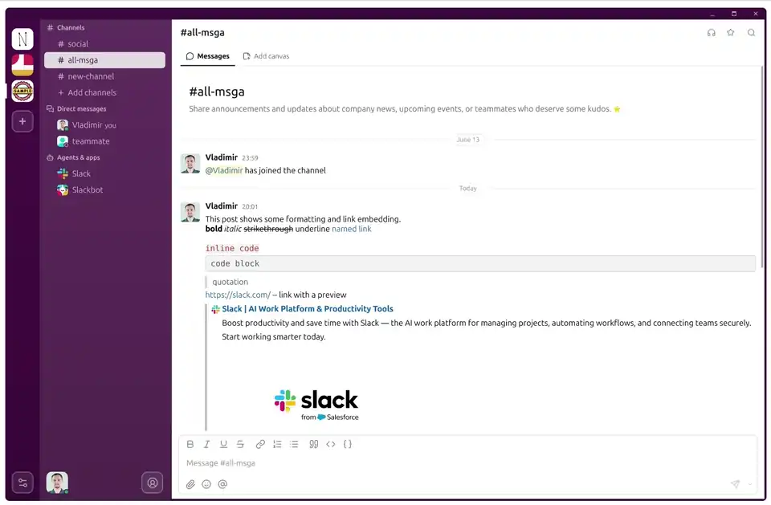

# Make Slack Great Again

A fast native Slack client built in C++ with Qt6.


## Demo



## Download

[](https://msga.app/download/msga-linux-x86_64)
[](https://msga.app/download/msga-macos-arm64.dmg)
[](https://msga.app/download/msga-windows-x86_64.exe)

## Or build your own version

msga does not ship with messaging credentials. You must register your own app with each service you want to connect and configure it before the client will connect. This is a one-time setup.

### Step 1. Set up a messaging backend

Pick the service(s) you want and follow the matching guide. Each ends by writing the credentials into `credentials.cmake`:

- **[Slack setup](docs/SETUP_SLACK.md)** — create a Slack app, scopes, socket mode, events.
- **[Microsoft Teams setup](docs/SETUP_TEAMS.md)** — register an Entra app, Graph permissions, admin consent.

You can configure more than one — each fills in its own values in the same `credentials.cmake`, and the workspaces stack in the same rail.

The app version lives in `version.cmake` (tracked in git). Increment `MSGA_VERSION` there before each public release.

### Step 2. Configure build environment

> **Prerequisites:** CMake ≥ 3.24, Qt 6.x dev packages, a C++20 compiler (GCC 12+ / Clang 14+ / MSVC 2022+)

```sh
./scripts/configure-linux.sh    # for Linux
./scripts/configure-mac.sh      # for macOS
scripts/configure-windows.ps1   # for Windows
```

On Windows, run the PowerShell script from an **elevated** (Administrator) terminal:

```powershell
scripts\configure-windows.ps1
```

If you see _"running scripts is disabled"_, enable local scripts first (one-time, machine-wide):

```powershell
Set-ExecutionPolicy -ExecutionPolicy RemoteSigned -Scope LocalMachine
```

Or bypass the policy for a single run without changing the system setting:

```powershell
powershell -ExecutionPolicy Bypass -File scripts\configure-windows.ps1
```

### Step 3. Build and run

```sh
./scripts/build.sh
./build/msga                            # for Linux
./build/msga.app/Contents/MacOS/msga    # for macOS
```

On Windows:

```powershell
scripts\build.ps1
build\Debug\msga.exe
```

If you see _"running scripts is disabled"_, see the execution policy note in Step 2, or run directly:

```powershell
powershell -ExecutionPolicy Bypass -File scripts\build.ps1
```
